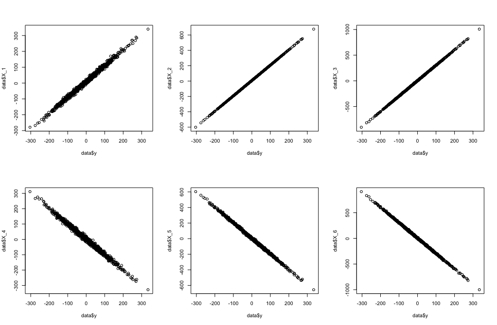
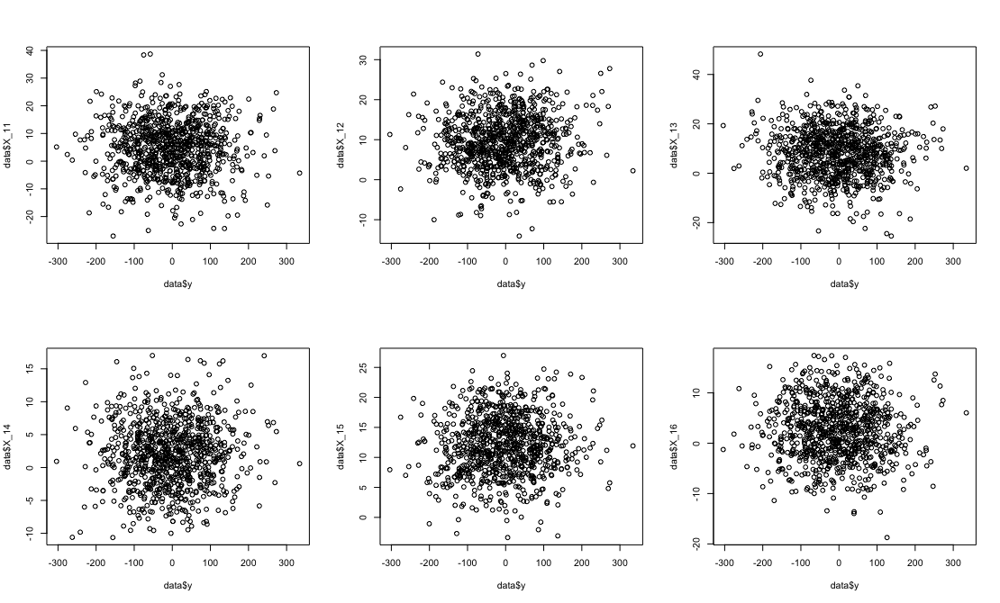
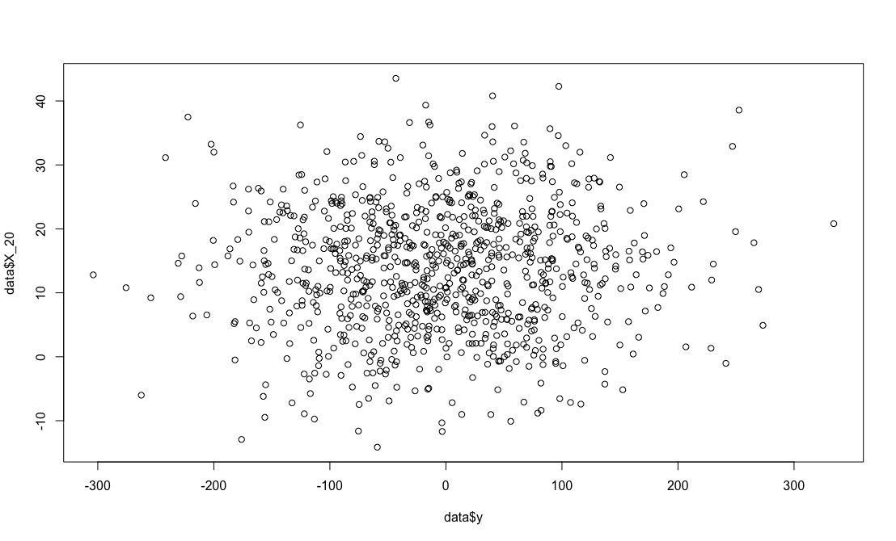

```{r setup, include=FALSE}
knitr::opts_chunk$set(echo = TRUE, include = TRUE)
```

# Thought Experiment | Find some lucky pennies
<div class = "notes">
Imagine that you have 50 pennies labeled 1 through 50 and 
you flip each one 10 times and write on each coin how many 
times it landed head side up.

</div>

## Set It Up {.build}
```{r setup-coin-toss-small}
set.seed(123)
n_coins <- 50
tosses <- 10
p_heads <- 0.5
```
```{r coin-toss-small}
results <- rbinom(n_coins, tosses, p_heads)

```

<div class="notes">

I should have said, that we are looking for some lucky pennies,
because I going to use the lucky pennies we find in a magic 
trick later. To find a lucky penny, I need to decide how many 
heads I need to observe to be surprised. 

I am going to cheat, because I happen to remember just enough 
theoretical statistics to know that when you observe a group 
of boolean trials, you can use the binomial distribution to 
calculated the probability of observing any number of one type 
of observation (heads) out of a known number of trials. 
(We are not going to show the equation, but it's a 
combinatorial expression with factorials so it is pretty.)

For the sake of brevity, I am going to tell you it takes 
a lot to surprise me.


</div>

## What Is Surprising {.build}
```{r what-is-a-surprise1, echo=TRUE, include = TRUE}
dbinom(7, tosses, p_heads)
```

```{r what-is-a-surprise2, echo=TRUE, include = TRUE}
dbinom(8, tosses, p_heads)
```

```{r what-is-a-surprise3, echo=TRUE, include = TRUE}
dbinom(9, tosses, p_heads)
```

```{r what-is-a-surprise4, echo=TRUE, include = TRUE}
dbinom(10, tosses, p_heads)

```

## This Is Surprising Enough (I think ??)

```{r set-surprises, echo=TRUE, include = TRUE}
surprise_threshhold <- 8

```

<div class="notes">

I am going to be a traditionalist here and decide I will be surprised if there 
are `r surprise_threshhold` or more heads out of `r tosses` tosses.
</div>

## Being the Geeks We Are {.build}
```{r find-surprises}
picks <- seq_along(results)[results >= surprise_threshhold]
```
```{r see-surprises}
picks
results[results >= surprise_threshhold]

```

## What Did We Just Accomplish? {.build}
-  I am pleased that I found so many valuable pennies out of `r n_coins`.
-  I have thoughtfully recorded how many heads I observed on each lucky penny 
so I do not need to do all that sampling stuff again.


<div class="notes">
I can confidently carry these pennies into my magic show knowing they will 
continue to perform as well there as they did here.

</div>

## What Have We Seen? {.build}
- Root cause of where stepwise methods go wrong

<div class="notes">
Now as statisticians, `r tosses` is not a big enough sample for a good 
estimate so let's make it bigger.
</div>


## Stepwise Methods {.build}
- Forward Selection
- Backward Selection
- Stepwise Selection

## Stepwise Methods {.build}

- Forward Selection
  - Sequentially adds predictors having the most effect
  - Stop when no __significant__ improvement can be obtained

## Stepwise Methods {.build}

- Backward Selection
  - Starts with full model
  - Predictors are removed one by one based on the least effect ($F$ statistic)
  - Stop when all remaining predictors have F statistics at least as large 
  as a __stay__ threshold

## Stepwise Methods {.build}

- Stepwise Selection
  - Sequentially adds predictors having the most effect and greater than __entry__ threshold
  - Removes predictors with effect less than __stay__ threshold
  - Optional: Stop when no __significant__ improvement can be obtained

## Statistical Issues {.build}

- Yields $R^2$ values that are biased to be high
- Based on methods (e.g., $F$ tests for nested models) intended to be used 
to test prespecified hypotheses
- $F$ and $\chi^2$ tests do not have their claimed distributions
- Yields $p$-values that do not have the proper meaning
- Gives biased regression coefficients that need shrinkage

## Effects Demonstrated in 1970's and 1980's {.build}

- Has severe problems in the presence of collinearity
- Does not select model having minumum mean residual squared error
- Users often attribute relative importance to order of when variables go 
in and out of model

## Effects Demonstrated in 1992 {.build}

- Number of candidate predictor variables affected the number of noise 
variables that gained entry to the model

## Effects Demonstrated in 1992

- Number of candidate predictor variables affected the number of noise 
variables that gained entry to the model

   Predictors | Noise  | %Noise
   -----------|--------|-------
   12         | 0.43   | 20
   18         | 0.96   | 40
   24         | 1.44   | 46
   
   
## Effects Demonstrated in 1992

- Number of candidate predictor variables affected the number of noise 
variables that gained entry to the model

   - Effect of multicollinearity (correlation of 0.4)

   Predictors | Noise  | %Noise
   -----------|--------|-------
   12         | 0.47   | 35
   18         | 0.93   | 59
   24         | 1.36   | 62

## Effects Demonstrated in 1992

- Number of candidate predictor variables affected the number of noise 
variables that gained entry to the model

   Predictors | Actual | Noise  | %Noise
   -----------|--------|--------|-------
   12         | 1.70   | 0.43   | 20
   18         | 1.64   | 0.96   | 40
   24         | 1.66   | 1.44   | 46
   
   
## Effects Demonstrated in 1992

- Number of candidate predictor variables affected the number of noise 
variables that gained entry to the model

   - Effect of multicollinearity (correlation of 0.4)

   Predictors | Actual | Noise  | %Noise
   -----------|--------|--------|-------
   12         | 0.86   | 0.47   | 35
   18         | 0.87   | 0.93   | 59
   24         | 0.83   | 1.36   | 62

## Effects Demonstrated in 1992 {.build}

- Number of candidate predictor variables affected the number of noise 
variables that gained entry to the model
- Authentic variables selected less than $0.5$ the time
- Noise variables selected $0.20$ to $0.74$ of the time
- Increasing sample size does not help much
- $R^2 \propto$ number candidate predictor variables and not the number
of final predictor variables
- Method yields confidence intervals for effects and predicted values 
that are falsely narrow

## What If You Have Great Data


```{r, out.width = "700px", echo = FALSE}

```

## And Noisy Noise

```{r, out.width = "700px", echo = FALSE}

```

## You Pick Noise

```{r, out.width = "700px", echo = FALSE}

```

## What If You Change Thresholds

$N = 900$

Predictors | Noise $\alpha = 0.0016$ |Noise $\alpha = 0.15$
-----------|-------------------------|----------------------
12         | 2                       | 2
18         | 3                       | 3
24         | 4                       | 4
50         | 8                       | 10
100        | 16                      | 17


## Options {.build}

- Gold standard: know your domain, pick predictive variables, keep them all
- Least Absolute Shrinkage and Selection Operator (LASSO) or elastic nets 
if multicollinearity is a possibility.

## Lasso

$min||\mathbf{y - X\beta}||^2$ subject to $\sum\limits_{j=1}^{m} |\beta_{j}| \leq t$

## Elastic Net

$min||\mathbf{y - X\beta}||^2$ subject to $\sum\limits_{j=1}^{m} |\beta_{j}| \leq t_1$,  $\sum\limits_{j=1}^{m} \beta_{j}^{2} \leq t_2$


